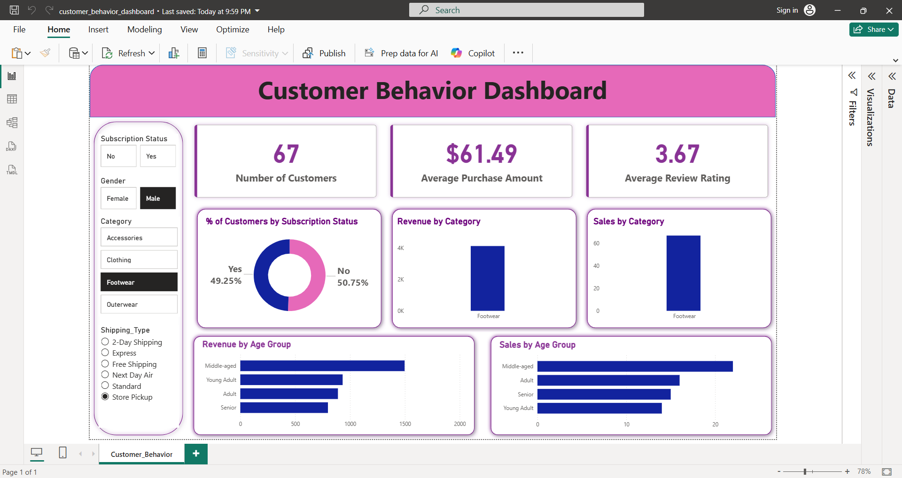

# 🛍️ Customer Behavior Analytics: Turning Raw Data into Business Strategy



## 🌟 The "Why" Behind This Project
Raw data is just noise until it answers a specific question. Most businesses are "data-rich" but "insight-poor"—they have rows of transactions but don't know who their most valuable customers are or if their discount strategies actually work.

I built this project to bridge that gap. By analyzing shopping patterns, I’ve transformed a standard dataset into a **strategic roadmap** that helps a business decide where to spend their marketing budget and how to improve customer retention.

---

## 🎯 The Problem Statement
Many businesses collect data but struggle to extract meaning from it. I focused on answering the high-stakes questions that drive growth:
* **The Revenue Gap:** Which demographic segments are our true heavy hitters?
* **The Discount Paradox:** Do discounts actually drive higher spending, or do they just hurt our margins?
* **Loyalty vs. Novelty:** Are repeat buyers more valuable than new acquisitions in the long run?
* **Product Performance:** Which categories are "hero" products and which ones are underperforming?

---

## 🛠️ Tech Stack & Workflow
I followed a three-stage pipeline to ensure the data was clean, the logic was sound, and the results were visual.

* **SQL:** The engine. Used for complex window functions, customer segmentation (New vs. Loyal), and revenue aggregations.
* **Python (Pandas):** The scout. Used for initial Data Exploration (EDA) and preprocessing.
* **Power BI:** The storyteller. Used to build an interactive dashboard for non-technical stakeholders.
* **Jupyter Notebook:** The lab. Where the data cleaning and preliminary analysis lived.

---

## 📊 Key Questions Answered
* **Revenue Splits:** Comparing spending behavior across gender and age groups.
* **Shipping Impact:** Does Express shipping lead to higher order values?
* **Subscription Value:** Do subscribed customers exhibit higher brand loyalty?
* **Discount Efficiency:** Identifying which products have the highest discount usage vs. their actual rating.
* **Segmentation:** Grouping customers into **New, Returning, and Loyal** tiers based on behavior.

---

## 📁 Project Structure
```

Customer-Behavior-Analytics-Revenue-Insights-Dashboard/
│
├── data/
│   └── customer_shopping_behavior.csv
│
├── sql/
│   └── customer_behavior_sql_queries.sql
│
├── notebook/
│   └── Customer_Shopping_Behavior_Analysis.ipynb
│
├── dashboard/
│   └── customer_behavior_dashboard.pbix
│
├── images/
│   └── dashboard_preview.png
├── requirements.txt          
│
└── README.md

```
---

## How to Run Locally
1. Clone the repository
```
git clone https://github.com/yourusername/customer-behavior-analytics-dashboard.git
cd customer-behavior-analytics-dashboard
```
2. Open and explore the SQL queries

Open the SQL file below in your SQL editor and run the queries:
```
sql/customer_behavior_sql_queries.sql
```
Make sure your database table is created and the dataset is loaded before running the queries.

3. Run the Jupyter notebook

If you want to explore the analysis in Python, install the required packages first:
```
pip install pandas matplotlib notebook
```
Then start Jupyter Notebook:

jupyter notebook

Open the notebook:
```
notebook/Customer_Shopping_Behavior_Analysis.ipynb
```
4. Open the Power BI dashboard

Open the Power BI file below in Power BI Desktop:
```
dashboard/customer_behavior_dashboard.pbix
```
If the data source path is broken, reconnect it to the CSV file inside the data/ folder.

Main Insights

This project helped reveal how different customer groups behave in different ways.

Some of the main insights include:
```
spending patterns change across customer segments
discounts do not always lead to higher spending
repeat customers are important for long-term revenue
product performance is not the same across all categories
age and subscription status can influence buying behavior
```
What I Learned

This project helped me improve both the technical and business side of data analysis.

I learned how to:
```
turn business questions into SQL queries
analyze customer behavior using structured data
connect raw data with dashboard storytelling
present insights in a way that is easy to understand
think beyond numbers and focus on business value
```
Future Improvements
```
There is still room to take this project further.
```
Some ideas for future work:
```
customer churn prediction
product recommendation system
automated data pipeline
deeper segmentation using machine learning
monthly and seasonal trend analysis
```
---
## Conclusion

This project shows how customer data can be transformed into meaningful business insights.

The focus was not only on finding numbers, but on understanding what those numbers mean for a business. From revenue analysis to customer segmentation, this project gives a clear picture of shopping behavior and decision-making patterns.
---
## Contact

If you found this project useful, feel free to connect and share feedback.
